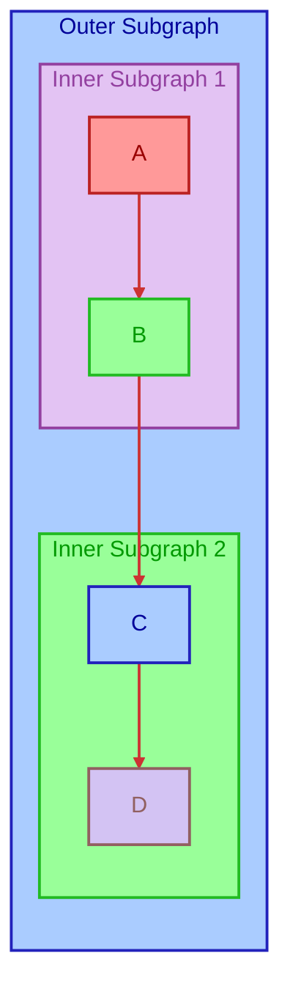

# Markup Mermaid Diagrams

```mermaid
graph LR

linkStyle default stroke:#c33,stroke-width:1.5pt;

classDef RED fill:#f99,color:#900,stroke:#b22,stroke-width:1.5pt;
classDef GRN fill:#9f9,color:#090,stroke:#2b2,stroke-width:1.5pt;
classDef BLU fill:#acf,color:#009,stroke:#22b,stroke-width:1.5pt;
classDef LAV fill:#d3c3f3,color:#916060,stroke:#916060,stroke-width:1.5pt;

style graph0 fill:#acf,color:#009,stroke:#22b,stroke-width:1.5pt;
style graph1 fill:#e3c3f3,color:#9340a0,stroke:#9340a0,stroke-width:1.5pt;
style graph2 fill:#9f9,color:#090,stroke:#2b2,stroke-width:1.5pt;

subgraph graph0[Outer Subgraph]
  subgraph graph1[Inner Subgraph 1]
    A:::RED --> B:::GRN
  end

  subgraph graph2[Inner Subgraph 2]
    C:::BLU --> D:::LAV
  end

  B --> C
end
```
