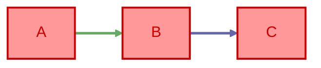

# Markup Mermaid Code Block

```mermaid
graph LR

classDef RED fill:#f99,color:#c00,stroke:#c00,stroke-width:2px;

A:::RED --> B:::RED --> C:::RED

linkStyle 0 stroke:#6a6,stroke-width:2pt;
linkStyle 1 stroke:#66a,stroke-width:2pt;

```
